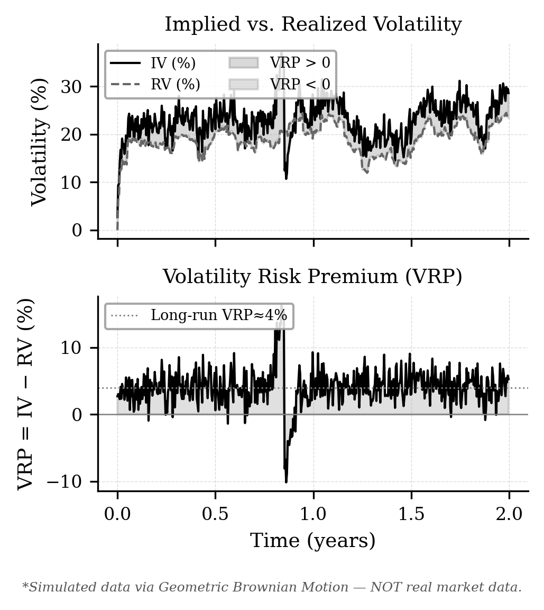
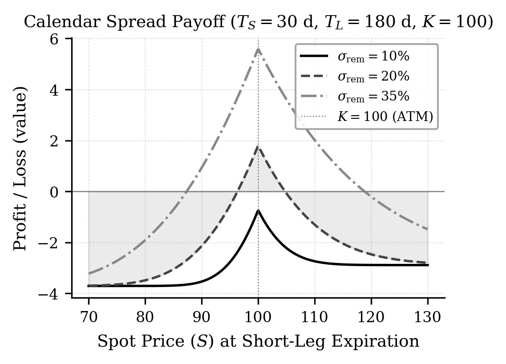

# Calendar & VRP

ประกอบ Long option อายุไกลกับ Short option อายุใกล้ แล้วติดตาม Net Greeks และส่วนต่าง IV − RV

## กลยุทธ์ Calendar Spread

Long Calendar Spread ประกอบด้วยการซื้อออปชันอายุไกลและขายออปชันชนิดเดียวกันที่ราคาใช้สิทธิเดียวกันแต่อายุใกล้ โดยมักได้ประโยชน์จากการเสื่อมของมูลค่าเวลาขาสั้นเมื่อราคาอยู่ใกล้ราคาใช้สิทธิ และจาก IV ที่เพิ่มขึ้นเมื่อ Net Vega เป็นบวก ทั้งนี้ IV ของสองอายุอาจเปลี่ยนต่างกัน จึงต้องพิจารณาแยกแต่ละขา ([Options Industry Council](https://www.optionseducation.org/strategies/all-strategies/long-call-calendar-spread-call-horizontal)).

## Volatility Risk Premium

ในบทเรียนนี้ใช้คำว่า VRP ในความหมายอย่างง่ายว่า $IV-RV$ โดยเปรียบเทียบความผันผวนที่ปรับเป็นรายปีและอ้างอิงช่วงเวลาเดียวกัน ส่วนงานของ [Carr and Wu (2009)](https://doi.org/10.1093/rfs/hhn038) ศึกษา **variance risk premium** และใช้ผลต่างระหว่าง realized variance กับอัตรา variance swap ซึ่งต่างทั้งหน่วยและข้อตกลงเรื่องเครื่องหมาย จึงไม่ควรนำค่าตัวเลขมาเทียบกับ $IV-RV$ โดยตรง การพบส่วนต่างบวกหรือลบเพียงอย่างเดียวไม่ได้รับประกันกำไรของ Calendar Spread.

รูปที่ 1 แสดงตัวอย่าง IV, RV และส่วนต่าง $IV-RV$ จากข้อมูลจำลองตลอดสองปี ใช้ประกอบการอ่านเครื่องหมายของส่วนต่าง ไม่ได้เป็นหลักฐานว่า IV ต้องลู่เข้าหา RV หรือว่าจุดที่ IV พุ่งสูงเป็นโอกาสทำกำไรเสมอ.

<figure class="source-figure" id="fig:vrp_sim" data-latex-placement="H">

<figcaption><strong>รูปที่ 1.</strong> การจำลอง Implied Volatility (IV), Realized Volatility (RV) และ Volatility Risk Premium (VRP = IV − RV) ด้วย Geometric Brownian Motion บนช่วงเวลา 2 ปี พื้นที่แรเงาสีเข้ม = VRP&gt;0 (IV&gt;RV), สีอ่อน = VRP&lt;0 (RV&gt;IV). <em>หมายเหตุ: เป็นข้อมูลจำลอง ไม่ใช่ข้อมูลตลาดจริง.</em></figcaption>
</figure>

## โครงสร้างกลยุทธ์ Calendar Spread

กลยุทธ์ Calendar Spread มีโครงสร้างพื้นฐานดังนี้:

- **SHORT**: ขายออปชั่น Call/Put อายุสั้น (near-term expiration)

- **LONG**: ซื้อออปชั่น Call/Put อายุยาว (far-term expiration)

- ราคาใช้สิทธิ (strike price) ของทั้งสองขาต้องเท่ากัน

### กำไร-ขาดทุน ณ วันหมดอายุของขาสั้น

เมื่อขา SHORT หมดอายุที่เวลา $T_S$ กำไร-ขาดทุน (P&L) ของ Call Calendar Spread ก่อนต้นทุนธุรกรรมและต้นทุนเงินทุนคือ: $$\begin{equation}
  \begin{split}
    \text{P\&L}(S_{T_S}) &= \underbrace{C\!\left(S_{T_S},K,T_L - T_S,r,\sigma_{\mathrm{rem}}\right)}_{\text{มูลค่าขา LONG ที่เหลือ}} \\
    &\quad - \underbrace{\max(S_{T_S}-K,\,0)}_{\text{ภาระชำระของขา SHORT}} - \underbrace{C_0}_{\text{ต้นทุนเริ่มต้น}},
  \end{split}
  \label{eq:payoff}
\end{equation}$$ โดยที่ $C_0 = C(S_0,K,T_L,r,\sigma_0) - C(S_0,K,T_S,r,\sigma_0)$ คือ net debit ที่จ่ายเมื่อเข้าสถานะ และ $\sigma_{\mathrm{rem}}$ คือ IV ของขา LONG ที่เหลือ ณ $T_S$ สูตรนี้หักต้นทุนเริ่มต้นแล้วจึงเป็น P&L ไม่ใช่ payoff ของออปชันเพียงอย่างเดียว หากคิดต้นทุนเงินทุนที่อัตรา $r$ ต้องใช้ $C_0e^{rT_S}$ แทน $C_0$ รูปที่ 4 แสดง P&L รูป “hump” ซึ่งสูงสุดใกล้ ATM แต่ยอดอาจยังติดลบได้เมื่อ IV ของขา LONG ลดลงมาก.

<figure class="source-figure" id="fig:payoff" data-latex-placement="H">

<figcaption><strong>รูปที่ 4.</strong> กำไร-ขาดทุน (P&L) ของ Calendar Spread ณ วันหมดอายุของขา SHORT (<em>T</em><em>S</em> = 30 วัน, <em>T</em><em>L</em> = 180 วัน, <em>K</em> = 100, <em>σ</em>0 = 20%) ที่ระดับ Residual Volatility (<em>σ</em>rem) ต่างกัน. P&L สูงสุดที่ ATM ในตัวอย่างและลดลงเมื่อราคาออกห่างจาก <em>K</em>. ชื่อกราฟใช้คำว่า Payoff แต่แกนตั้งแสดงกำไร-ขาดทุนหลังหักต้นทุนเริ่มต้นแล้ว.</figcaption>
</figure>

ภายใต้พารามิเตอร์ตัวอย่างใกล้ ATM และ IV เดียวกันทั้งสองขา ค่ากรีกรวม (Net Greek) ของกลยุทธ์มีลักษณะดังนี้ โดยเครื่องหมายอาจเปลี่ยนเมื่อราคา อายุสัญญา หรือ IV ของแต่ละขาต่างจากตัวอย่าง: $$\begin{align}
  \Delta_{\text{net}} &= \Delta_{\text{LONG}} - \Delta_{\text{SHORT}} \approx 0
    \quad \text{(ใกล้ศูนย์ที่ ATM)}, \\
  \Gamma_{\text{net}} &= \Gamma_{\text{LONG}} - \Gamma_{\text{SHORT}} < 0, \\
  \Theta_{\text{net}} &= \Theta_{\text{LONG}} - \Theta_{\text{SHORT}} > 0, \\
  \nu_{\text{net}}    &= \nu_{\text{LONG}}    - \nu_{\text{SHORT}}    > 0.
\end{align}$$
