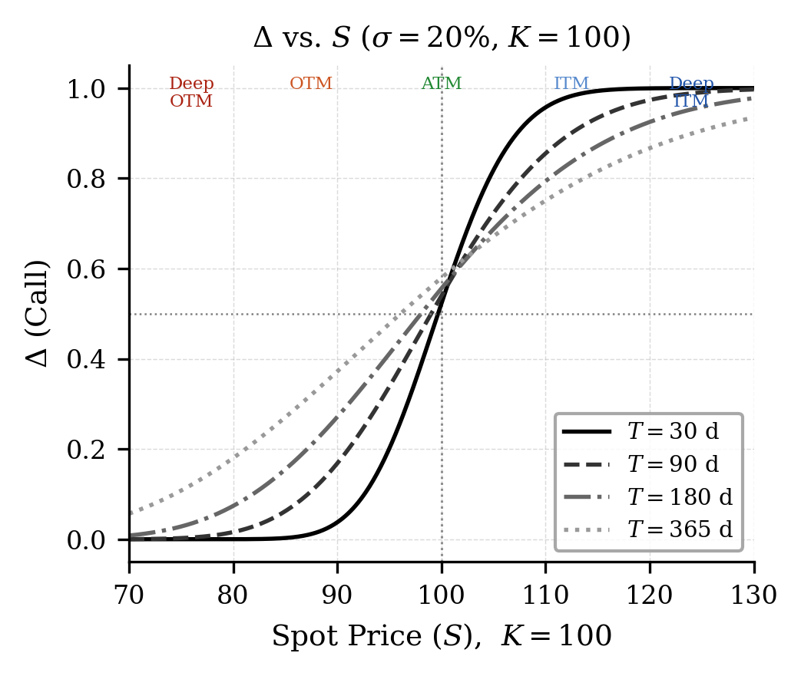
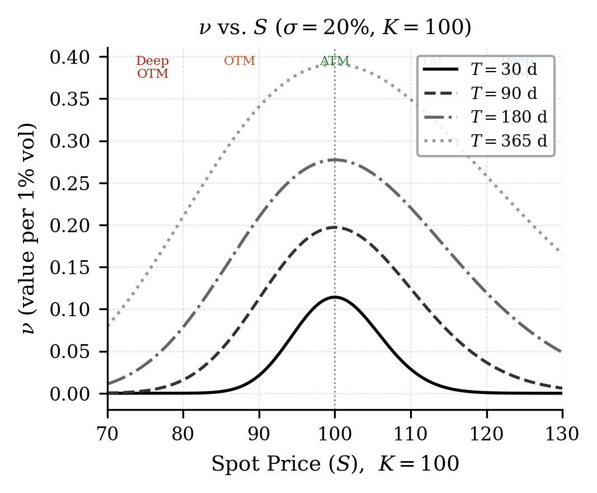

# The Five Greeks

อ่านค่าความไวทั้งห้าเป็นภาษาของทิศทาง ความโค้ง เวลา ความผันผวน และอัตราดอกเบี้ย

## ระเบียบวิธีวิจัย (Methodology)

### การนิยามค่ากรีก

ค่ากรีก (Greek) คือตัวชี้วัดความไว (sensitivity measures) ของราคาออปชั่นต่อการเปลี่ยนแปลงของปัจจัยต่าง ๆ โดยมีนิยามทางคณิตศาสตร์และสัญลักษณ์ที่ใช้กันโดยทั่วไปดังนี้

#### Delta ($\Delta$)

เดลต้าวัดอัตราการเปลี่ยนแปลงของราคาออปชั่นต่อการเปลี่ยนแปลงหนึ่งหน่วย ของราคาสินทรัพย์อ้างอิง: $$\begin{equation}
  \Delta = \frac{\partial V}{\partial S}.
  \label{eq:delta}
\end{equation}$$ จากแบบจำลองแบล็ก-โชลส์สำหรับออปชั่น Call: $\Delta_{\text{call}} = N(d_1)$ และสำหรับออปชั่น Put: $\Delta_{\text{put}} = N(d_1) - 1$.

**ความสัมพันธ์เชิงแปรผัน:**

- $\Delta$ เพิ่มแบบทิศทางเดียว (monotonic) ตาม $S$ (Deep ITM $\to 1$, Deep OTM $\to 0$ สำหรับ Call): $$\frac{\partial \Delta}{\partial S} = \Gamma > 0,
            \quad \lim_{S\to\infty}\Delta_{\text{call}} = 1,
            \quad \lim_{S\to 0}\Delta_{\text{call}} = 0.$$

- $\Delta$ แปรผกผันกับ $T$: ที่ ATM ความชันยิ่งสูงเมื่ออายุสั้น: $$\left.\frac{\partial \Delta}{\partial S}\right|_{\text{ATM}}
            = \Gamma_{\text{ATM}} \propto \frac{1}{\sqrt{T}}
            \;\xrightarrow{\,T\to 0\,}\; \infty.$$

- โดยรวม $\Delta$ ไม่เป็นเชิงเส้นใน $S$ แต่เป็น sigmoid ของ $\ln(S/K)$ ผ่าน $N(d_1)$: $$\Delta \approx N\!\left(\frac{\ln(S/K)}{\sigma\sqrt{T}}\right)
            \quad (\text{ละ } r \text{ เพื่อ intuition}).$$

<table>
<caption>สัญลักษณ์ของ Delta ตามสถานะ Long/Short</caption>
<thead>
<tr>
<th style="text-align: left;"><strong>ตำแหน่ง</strong></th>
<th style="text-align: center;"><strong>Call</strong></th>
<th style="text-align: center;"><strong>Put</strong></th>
</tr>
</thead>
<tbody>
<tr>
<td style="text-align: left;">Long</td>
<td style="text-align: center;">+ (0, +1)</td>
<td style="text-align: center;">− (−1, 0)</td>
</tr>
<tr>
<td style="text-align: left;">Short</td>
<td style="text-align: center;">− (−1, 0)</td>
<td style="text-align: center;">+ (0, +1)</td>
</tr>
</tbody>
</table>

เดลต้าของพอร์ตโฟลิโอ Calendar Spread มีแนวโน้มใกล้ศูนย์เมื่ออยู่ที่ ATM เนื่องจาก $\Delta$ ของขา SHORT และ LONG หักล้างกันบางส่วนรูปที่ 2 แสดงค่า $\Delta$ เทียบกับราคาสินทรัพย์อ้างอิงที่อายุสัญญาต่างกัน.

<figure class="source-figure" id="fig:delta" data-latex-placement="H">

<figcaption><strong>รูปที่ 2.</strong> Delta (<em>Δ</em>) ของออปชั่น Call เทียบกับราคาสินทรัพย์อ้างอิง ที่อายุสัญญาต่างกัน (<em>σ</em> = 20%)</figcaption>
</figure>

#### Gamma ($\Gamma$)

แกมมาวัดอัตราการเปลี่ยนแปลงของ $\Delta$ ต่อการเปลี่ยนแปลงของราคาสินทรัพย์อ้างอิง หรือเทียบเท่ากับอนุพันธ์อันดับสองของมูลค่าออปชั่นต่อราคาสินทรัพย์: $$\begin{equation}
  \Gamma = \frac{\partial^2 V}{\partial S^2} = \frac{\partial \Delta}{\partial S}.
  \label{eq:gamma}
\end{equation}$$ จากแบบจำลองแบล็ก-โชลส์: $$\begin{equation}
  \Gamma = \frac{N'(d_1)}{S\,\sigma\,\sqrt{T}},
  \label{eq:gamma_bsm}
\end{equation}$$ โดยที่ $N'(\cdot)$ คือฟังก์ชันความหนาแน่นของความน่าจะเป็นที่แจกแจงปกติมาตรฐาน (PDF)

<table>
<caption>สัญลักษณ์ของ Gamma ตามสถานะ Long/Short</caption>
<thead>
<tr>
<th style="text-align: left;"><strong>ตำแหน่ง</strong></th>
<th style="text-align: center;"><strong>Call</strong></th>
<th style="text-align: center;"><strong>Put</strong></th>
</tr>
</thead>
<tbody>
<tr>
<td style="text-align: left;">Long</td>
<td style="text-align: center;">+ (Positive <em>Γ</em>)</td>
<td style="text-align: center;">+ (Positive <em>Γ</em>)</td>
</tr>
<tr>
<td style="text-align: left;">Short</td>
<td style="text-align: center;">− (Negative <em>Γ</em>)</td>
<td style="text-align: center;">− (Negative <em>Γ</em>)</td>
</tr>
</tbody>
</table>

ข้อสังเกตสำคัญคือ $\Gamma$ มีค่าสูงสุดที่ตำแหน่ง ATM และลดลงเมื่อออปชั่นอยู่ในสถานะ ITM หรือ OTM อย่างลึก นอกจากนี้ สัญญาที่มีอายุสั้นกว่าจะมี $\Gamma$ สูงกว่าสัญญาที่มีอายุยาวกว่า ณ ตำแหน่ง ATM: $$\begin{equation}
  \Gamma_{\text{SHORT}} > \Gamma_{\text{LONG}} \quad \text{(ณ ตำแหน่ง ATM)}.
  \label{eq:gamma_ineq}
\end{equation}$$

**ความสัมพันธ์เชิงแปรผัน:** จาก [eq:gamma_full] เมื่อ ATM ($S \approx K$) และ $N'(d_1) \approx \text{const}$: $$\begin{align}
  \Gamma &\propto \frac{1}{\sigma}
    \quad &\text{(แปรผกผันกับ } \sigma\text{)}, \label{eq:gamma_inv_sig} \\
  \Gamma &\propto \frac{1}{\sqrt{T}}
    \quad &\text{(แปรผกผันกับ } \sqrt{T}\text{)}, \label{eq:gamma_inv_T} \\
  \Gamma &\propto \frac{1}{S}
    \quad &\text{(แปรผกผันกับ } S \text{ โดยประมาณ)}. \label{eq:gamma_inv_S}
\end{align}$$ กล่าวคือความผันผวนที่สูง $\sigma$ ทำให้ $\Gamma$ ต่ำลงที่ ATM (กราฟ $\Gamma$ ราบเรียบขึ้นหรือมีลักษณะแบนราบแล้วมีส่วนหางที่ยกสูงขึ้นดัง[รูปที่ 8](results.html#fig:gamma_vol)), และอายุสัญญาที่สั้น $T$ ทำให้ $\Gamma$ พุ่งสูงมากที่ ATM

#### Theta ($\Theta$)

ทีตาวัดอัตราการเปลี่ยนแปลงของมูลค่าออปชั่นเมื่อเวลาผ่านไปหนึ่งหน่วย (time decay): $$\begin{equation}
  \Theta = \frac{\partial V}{\partial t}.
  \label{eq:theta}
\end{equation}$$ จาก BSM สำหรับออปชั่น Call: $$\begin{equation}
  \Theta_{\text{call}} = -\frac{S\,N'(d_1)\,\sigma}{2\sqrt{T}}
                         - r\,K\,e^{-rT}\,N(d_2).
  \label{eq:theta_bsm}
\end{equation}$$

<table>
<caption>สัญลักษณ์ของ Theta ตามสถานะ Long/Short</caption>
<thead>
<tr>
<th style="text-align: left;"><strong>ตำแหน่ง</strong></th>
<th style="text-align: center;"><strong>Call</strong></th>
<th style="text-align: center;"><strong>Put</strong></th>
</tr>
</thead>
<tbody>
<tr>
<td style="text-align: left;">Long</td>
<td style="text-align: center;">− (Negative <em>Θ</em>)</td>
<td style="text-align: center;">− (Negative <em>Θ</em>)</td>
</tr>
<tr>
<td style="text-align: left;">Short</td>
<td style="text-align: center;">+ (Positive <em>Θ</em>)</td>
<td style="text-align: center;">+ (Positive <em>Θ</em>)</td>
</tr>
</tbody>
</table>

เนื่องจากอายุสัญญาของขา SHORT สั้นกว่า $\Theta$ จึงสูงกว่าในสัมบูรณ์ค่า (absolute value) แม้ว่าขา LONG จะมีผล Positive Gamma เสริมก็ตาม: $$\begin{equation}
  |\Theta_{\text{SHORT}}| > |\Theta_{\text{LONG}}|
  \quad \text{(ทั่วไปสำหรับ ATM Calendar Spread)}.
  \label{eq:theta_ineq}
\end{equation}$$

**ความสัมพันธ์เชิงแปรผัน:** จาก [eq:theta_full] พจน์หลักสำหรับ ATM มีรูป $-S\sigma N'(d_1)/(2\sqrt{T})$: $$\begin{align}
  |\Theta| &\propto \frac{1}{\sqrt{T}}
    \quad &\text{(แปรผกผันกับ } \sqrt{T}\text{)}, \label{eq:theta_inv_T} \\
  |\Theta| &\propto \sigma
    \quad &\text{(แปรผันตรงกับ } \sigma \text{ โดยประมาณ)}, \label{eq:theta_prop_sig} \\
  |\Theta| &\propto S
    \quad &\text{(แปรผันตรงกับ } S\text{)}. \label{eq:theta_prop_S}
\end{align}$$ ความสัมพันธ์ [eq:theta_prop_sig] เป็นเพียงการประมาณเมื่อ $N'(d_1)$ เปลี่ยนเล็กน้อย หาก $\sigma$ หรืออายุสัญญาสูงขึ้น พจน์นี้อาจเปลี่ยนมากจนความสัมพันธ์ไม่เป็นเส้นตรง จึงไม่มีระดับ $\sigma$ เดียวที่ใช้เป็นเกณฑ์ได้กับทุกอายุสัญญา.

ผลรวมจาก [eq:theta_inv_T] และ [eq:theta_prop_sig]: อายุสัญญาที่สั้นกับความผันผวนที่สูงนำไปสู่ $|\Theta|$ สูงสุดดังที่สังเกตได้จาก[รูปที่ 6](results.html#fig:theta_vol) ที่เส้น $\sigma=50\%$ มี $|\Theta|$ สูงที่สุดและพุ่งแรงที่สุดเมื่อใกล้หมดอายุ.

#### Vega ($\nu$)

เวกาวัดความไวของราคาออปชั่นต่อการเปลี่ยนแปลงความผันผวน (volatility): $$\begin{equation}
  \nu = \frac{\partial V}{\partial \sigma}.
  \label{eq:vega}
\end{equation}$$ จากแบบจำลองแบล็ก-โชลส์: $$\begin{equation}
  \nu = S\,\sqrt{T}\,N'(d_1).
  \label{eq:vega_bsm}
\end{equation}$$

<table>
<caption>สัญลักษณ์ของ Vega ตามสถานะ Long/Short</caption>
<thead>
<tr>
<th style="text-align: left;"><strong>ตำแหน่ง</strong></th>
<th style="text-align: center;"><strong>Call</strong></th>
<th style="text-align: center;"><strong>Put</strong></th>
</tr>
</thead>
<tbody>
<tr>
<td style="text-align: left;">Long</td>
<td style="text-align: center;">+ (Positive <em>ν</em>)</td>
<td style="text-align: center;">+ (Positive <em>ν</em>)</td>
</tr>
<tr>
<td style="text-align: left;">Short</td>
<td style="text-align: center;">− (Negative <em>ν</em>)</td>
<td style="text-align: center;">− (Negative <em>ν</em>)</td>
</tr>
</tbody>
</table>

สูตร Vega มีพจน์ $\sqrt{T}$ แต่ $N'(d_1)$ ก็ขึ้นกับเวลาและพารามิเตอร์อื่นด้วย จึงเป็นความสัมพันธ์โดยประมาณเมื่อพจน์นี้เปลี่ยนเล็กน้อย สำหรับพารามิเตอร์ตัวอย่างใกล้ ATM ขา LONG มี Vega สูงกว่าขา SHORT: $$\begin{equation}
  \nu_{\text{LONG}} > \nu_{\text{SHORT}}.
  \label{eq:vega_ineq}
\end{equation}$$

**ความสัมพันธ์เชิงแปรผัน:** จาก [eq:vega_full]: $$\begin{align}
  \nu &\propto \sqrt{T}
    \quad &\text{(แปรผันตรงกับ } \sqrt{T}\text{)}, \label{eq:vega_prop_T} \\
  \nu &\propto S
    \quad &\text{(แปรผันตรงกับ } S\text{)}, \label{eq:vega_prop_S} \\
  \nu &\propto N'(d_1)
    \quad &\text{(สูงสุดที่ ATM เมื่อ } N'(d_1) \text{ สูงสุด)}. \label{eq:vega_prop_nd1}
\end{align}$$ เมื่อ $\sigma$ สูงขึ้น $d_1$ เพิ่มขึ้นทำให้ $N'(d_1)$ ลดลง ดังนั้น Vega ($\nu$) จึงแปรผกผันกับ $\sigma$ อย่างอ่อน ๆ สำหรับ Deep ITM/OTM แต่เกือบคงที่ที่ ATM ในช่วงปฏิบัติจริง.

รูปที่ 3 แสดงค่า $\nu$ ที่อายุสัญญาต่างกันยืนยันความสัมพันธ์ $\nu_{\text{LONG}} > \nu_{\text{SHORT}}$.

<figure class="source-figure" id="fig:vega" data-latex-placement="H">

<figcaption><strong>รูปที่ 3.</strong> Vega (<em>ν</em>) เทียบกับราคาสินทรัพย์อ้างอิง ที่อายุสัญญาต่างกัน (<em>σ</em> = 20%)</figcaption>
</figure>

#### Rho ($\rho$)

โร วัดความไวของราคาออปชั่นต่อการเปลี่ยนแปลงอัตราดอกเบี้ยปลอดความเสี่ยง: $$\begin{equation}
  \rho = \frac{\partial V}{\partial r}.
  \label{eq:rho}
\end{equation}$$ จากแบบจำลองแบล็ก-โชลส์สำหรับออปชั่น Call: $$\begin{equation}
  \rho_{\text{call}} = K\,T\,e^{-rT}\,N(d_2).
  \label{eq:rho_bsm}
\end{equation}$$

<table>
<caption>สัญลักษณ์ของ Rho ตามสถานะ Long/Short</caption>
<thead>
<tr>
<th style="text-align: left;"><strong>ตำแหน่ง</strong></th>
<th style="text-align: center;"><strong>Call</strong></th>
<th style="text-align: center;"><strong>Put</strong></th>
</tr>
</thead>
<tbody>
<tr>
<td style="text-align: left;">Long Call</td>
<td style="text-align: center;">+ (Positive <em>ρ</em>)</td>
<td style="text-align: center;">—</td>
</tr>
<tr>
<td style="text-align: left;">Short Call</td>
<td style="text-align: center;">− (Negative <em>ρ</em>)</td>
<td style="text-align: center;">—</td>
</tr>
<tr>
<td style="text-align: left;">Long Put</td>
<td style="text-align: center;">—</td>
<td style="text-align: center;">− (Negative <em>ρ</em>)</td>
</tr>
<tr>
<td style="text-align: left;">Short Put</td>
<td style="text-align: center;">—</td>
<td style="text-align: center;">+ (Positive <em>ρ</em>)</td>
</tr>
</tbody>
</table>

**ความสัมพันธ์เชิงแปรผัน:** จาก [eq:rho_full]: $$\begin{align}
  \rho_{\text{call}} &\propto T
    \quad &\text{(แปรผันตรงกับ } T\text{)}, \label{eq:rho_prop_T} \\
  \rho_{\text{call}} &\propto K
    \quad &\text{(แปรผันตรงกับ } K\text{)}, \label{eq:rho_prop_K} \\
  \rho_{\text{call}} &\propto N(d_2)
    \quad &\text{(สูงขึ้นเมื่อ deep ITM, ต่ำลงเมื่อ deep OTM)}. \label{eq:rho_prop_nd2}
\end{align}$$

$\rho$ แปรผันตรงกับ $T$ ดังนั้น $\rho$ จึงมีนัยสำคัญเป็นพิเศษเมื่อขา LONG มีอายุสัญญายาวนาน (เช่น 6 เดือนขึ้นไป) หรือในสภาวะที่อัตราดอกเบี้ยเปลี่ยนแปลงอย่างรวดเร็ว สำหรับ Calendar Spread ทั่วไปที่ใช้สัญญาอายุสั้น ผล $\rho_{net}$ มักมีค่าน้อยมากเมื่อเทียบกับค่ากรีกตัวอื่น.

