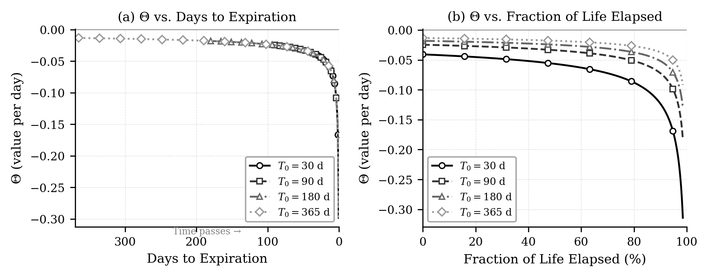
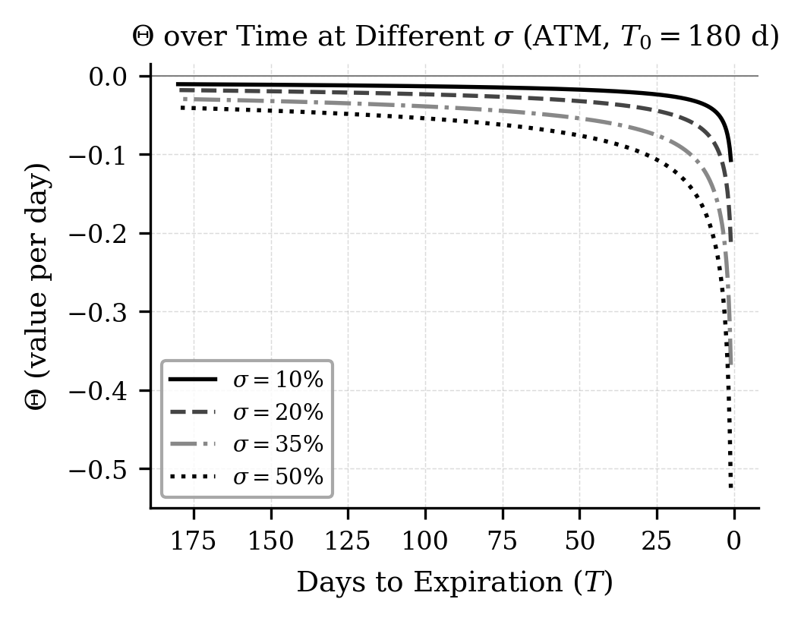
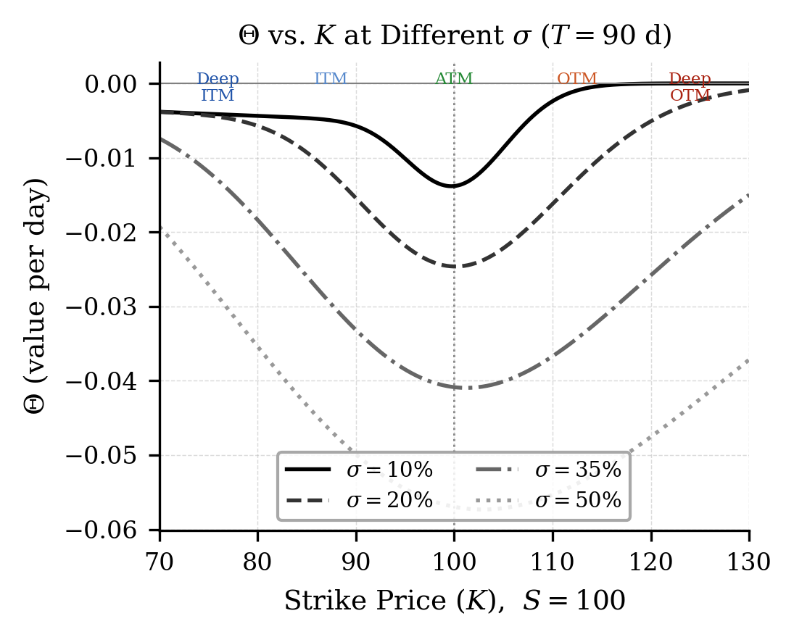
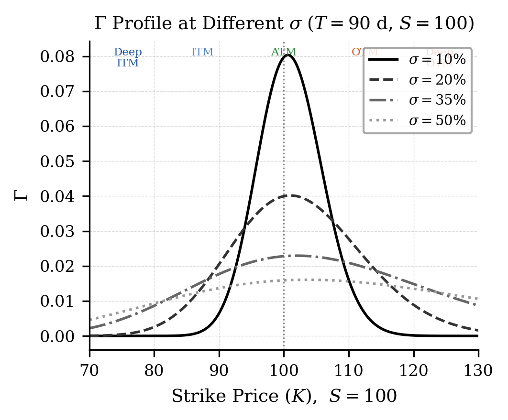
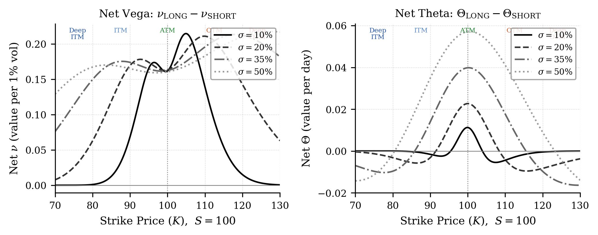

# Results & Discussion

อ่านผลของอายุสัญญา Volatility และ Moneyness ก่อนสรุปว่า Theta หรือ Gamma เด่นในแต่ละระบอบ

## ผลการทดลองและการอภิปราย (Results and Discussion)

### พฤติกรรมของ $\Theta$ ในกลยุทธ์ Calendar Spread

#### ผลของอายุสัญญาต่อ $\Theta$

รูปที่ 5 แสดงค่า $\Theta$ เทียบกับวันที่เหลือจนถึงวันหมดอายุ ที่อายุสัญญาเริ่มต้น ($T_0$) ต่างกัน แกน $x$ เรียงจากซ้าย (วันซื้อ) ไปสิ้นสุดที่ 0 วัน (วันหมดอายุ) ทางขวา สำหรับตัวอย่าง ATM ค่า $|\Theta|$ เพิ่มขึ้นเมื่อใกล้หมดอายุ หากเวลาคงเหลือ $T$ และพารามิเตอร์ $S,K,r,\sigma$ เท่ากัน ค่า Theta จะเท่ากันโดยไม่ขึ้นกับ $T_0$ ส่วนการเทียบที่สัดส่วนอายุผ่านไปเท่ากันทำให้สัญญา $T_0$ สั้นกว่ามีเวลาคงเหลือน้อยกว่า จึงมี $|\Theta|$ สูงกว่าในตัวอย่างนี้.

<figure class="source-figure" id="fig:theta_T" data-latex-placement="t">

<figcaption><strong>รูปที่ 5.</strong>  <strong>(a) Days to Expiration:</strong> แต่ละเส้นแทนออปชั่นที่มีอายุสัญญาเริ่มต้น <em>T</em>0 ต่างกัน เส้นเริ่มจากซ้าย (วันที่ซื้อ) และสิ้นสุดที่ 0 วัน (วันหมดอายุ) ทางขวา เส้นที่สั้นกว่าจึงเริ่มต้นทางขวามากกว่า ทำให้บางส่วนทับซ้อนกันในช่วง วันที่เหลือน้อย (ซึ่งเป็นคุณสมบัติที่ถูกต้องของสูตร BSM ไม่ใช่ข้อผิดพลาด) <strong>(b) Fraction of Life Elapsed:</strong> แกน <em>x</em> แสดงสัดส่วน <em>อายุที่ผ่านไปแล้ว</em> ของออปชั่นแต่ละตัว นิยามคือ FLE = (<em>T</em>0 − <em>T</em>rem)/<em>T</em>0 ∈ [0%, 100%) โดย 0% คือวันซื้อ และ ≈100% คือใกล้หมดอายุ การแสดงผลแบบนี้ทำให้ ออปชั่นทุกอายุเริ่มต้นที่ 0% พร้อมกัน เห็นได้ชัดว่า <em>T</em>0 สั้นกว่า ส่งผลให้ |<em>Θ</em>| เพิ่มขึ้นเร็วกว่าตามสัดส่วน (<em>σ</em> = 20%, ATM, <em>S</em> = <em>K</em> = 100).</figcaption>
</figure>

สำหรับพารามิเตอร์ตัวอย่าง ATM สัญญาขา SHORT อายุ 30 วันมีค่า Theta ของออปชันในค่าสัมบูรณ์สูงกว่าขา LONG อายุ 180 วัน เมื่อนำสถานะมาหักลบเป็น LONG − SHORT จึงได้ $\Theta_{\mathrm{net}}>0$ ซึ่งเป็นผลบวกจากเวลาที่ผ่านไปเมื่อปัจจัยอื่นคงที่.

#### ผลของความผันผวนต่อ $\Theta$

รูปที่ 6 แสดงผลกระทบของความผันผวน ($\sigma$) ในระดับต่างกันต่อค่า $\Theta$ ที่อายุสัญญา 90 วัน. เมื่อ $\sigma$ สูงขึ้น ค่าสัมบูรณ์ของ $\Theta$ เพิ่มขึ้น สอดคล้องกับสูตร [eq:theta_bsm] ที่มีพจน์ $S\,N'(d_1)\,\sigma$ ซึ่งแปรผันตรงกับ $\sigma$.

<figure class="source-figure" id="fig:theta_vol" data-latex-placement="H">

<figcaption><strong>รูปที่ 6.</strong> Theta (<em>Θ</em>) เทียบกับวันที่เหลือจนถึงวันหมดอายุ ที่ความผันผวน <em>σ</em> ต่างกัน (T = 90 วัน, ATM)</figcaption>
</figure>

ต้องแยกผลของเวลาที่ผ่านไปออกจากผลของ IV: เมื่อ $\nu_{\mathrm{net}}>0$ การที่ IV ของทั้งสองขาเพิ่มเท่ากันช่วยเพิ่มมูลค่าพอร์ต ส่วนการลดลงเท่ากันทำให้มูลค่าลดลง หาก IV ของแต่ละอายุเปลี่ยนต่างกัน ผลอันดับหนึ่งคือ $\Delta V\approx\nu_{\mathrm{LONG}}\Delta IV_{\mathrm{LONG}}-\nu_{\mathrm{SHORT}}\Delta IV_{\mathrm{SHORT}}$ ดังนั้น IV สูงหรือกำลังลดลงเพียงอย่างเดียวไม่ได้ระบุเวลาที่ดีที่สุดในการเข้ากลยุทธ์.

#### ผลของราคาใช้สิทธิ (Strike Price) ต่อ $\Theta$ (Moneyness Effect)

นอกจากอายุสัญญาและความผันผวนแล้ว ราคาใช้สิทธิ ($K$) หรือระดับ *Moneyness* ยังส่งผลสำคัญต่อค่า $\Theta$ รูปที่ 7 แสดงความสัมพันธ์ระหว่าง $\Theta$ กับ $K$ ที่ $\sigma$ ต่างกัน (อายุสัญญา 90 วัน, $S=100$):

<figure class="source-figure" id="fig:theta_K" data-latex-placement="H">

<figcaption><strong>รูปที่ 7.</strong> Theta (<em>Θ</em>) เทียบกับ Strike Price (<em>K</em>) ที่ความผันผวน <em>σ</em> ต่างกัน (<em>T</em> = 90 วัน, <em>S</em> = 100) พื้นที่แรเงาระบุระดับ Moneyness: Deep ITM, ITM, ATM, OTM, Deep OTM</figcaption>
</figure>

จากรูปพบข้อสังเกตสำคัญสามประการ:

1.  **ค่า $|\Theta|$ สูงสุดที่สถานะ ATM:** เมื่อราคาสินทรัพย์ใกล้ราคาใช้สิทธิ ($S \approx K$) จะได้ $d_1 \approx 0$ ซึ่งทำให้ความหนาแน่น $N'(d_1)$ มีค่าสูงสุด เท่ากับ $1/\sqrt{2\pi}$ ด้วยเหตุนี้ค่าเสื่อมของเวลาจึงรุนแรงที่สุด ที่จุด ATM กล่าวคือ $\arg\max_{K}|\Theta(K)| \approx S$ โดยมีขนาด $$|\Theta|_{\text{ATM}} \approx \frac{S\,\sigma}{2\sqrt{2\pi T}}.$$

2.  **ค่า $|\Theta|$ ลดลงสู่ศูนย์เมื่อออปชั่นอยู่ลึกในสถานะ OTM หรือ ITM:** เมื่อราคาใช้สิทธิห่างจากราคาสินทรัพย์มากขึ้นจน $|\ln(K/S)| \to \infty$ ทั้ง $d_1$ และ $d_2$ จะเบนออกไปสู่ $\pm\infty$ ส่งผลให้ $N'(d_1) \to 0$ มูลค่าเวลา (time value) ของออปชั่นจึงเหลือน้อยและการเสื่อมของเวลาช้าลงจนกระทั่ง $|\Theta| \to 0$.

3.  **ความผันผวนที่สูงขึ้นทำให้โปรไฟล์ $|\Theta|$ แผ่กว้าง:** ความกว้างของโปรไฟล์ $|\Theta|$ เมื่อพิจารณาเทียบกับ $\ln(K/S)$ แปรผันตาม $\sigma\sqrt{T}$ ดังนั้นแม้ค่ายอดที่ ATM จะเพิ่มขึ้นตาม $\sigma$ ($|\Theta|_{\text{ATM}} \propto \sigma$) แต่ความแตกต่าง ระหว่างสถานะ ATM กับ OTM/ITM กลับแคบลง เพราะมวลความน่าจะเป็น (probability mass) กระจายตัวกว้างขึ้น สะท้อนผ่านอัตราส่วน $|\Theta|_{\text{ATM}}/|\Theta|_{\text{OTM}}$ ที่ลดลงเมื่อ $\sigma$ เพิ่มขึ้น.

ในพารามิเตอร์ตัวอย่าง การเลือก $K\approx S$ ให้ $\Theta_{\mathrm{net}}=\Theta_{\mathrm{LONG}}-\Theta_{\mathrm{SHORT}}$ สูงใกล้ ATM แต่ $\Gamma_{\mathrm{net}}$ ก็ติดลบมากใกล้บริเวณเดียวกัน จึงต้องพิจารณาผลจาก time decay ควบคู่กับความเสี่ยงจากการเคลื่อนไหวของราคา.

### พฤติกรรมของ $\Gamma$ ในกลยุทธ์ Calendar Spread

ในพารามิเตอร์ตัวอย่างใกล้ ATM ขาอายุสั้นมี $\Gamma$ สูงกว่าขาอายุไกล จึงได้ $\Gamma_{\mathrm{net}}<0$ สอดคล้องกับความสัมพันธ์โดยประมาณ [eq:gamma_inv_T] เมื่อปัจจัยอื่นใกล้เคียงกัน การเคลื่อนไหวของราคาเพิ่มความเสี่ยงจาก Short Gamma แต่เครื่องหมายและขนาดของ Net Gamma ต้องคำนวณใหม่เมื่อ moneyness หรือ IV ของสองขาเปลี่ยนไป.

#### ผลของความผันผวนต่อ $\Gamma$

รูปที่ 8 แสดงว่าในพารามิเตอร์ที่ใช้ เมื่อ $\sigma$ สูงขึ้น กราฟ $\Gamma$ ใกล้ ATM จะแผ่กว้างและยอดลดลง ขณะที่ $\sigma$ ต่ำทำให้กราฟแหลมขึ้น การเปรียบเทียบนี้เป็นผลของระดับ IV ในแบบจำลอง ไม่ได้แปลว่า $IV>RV$ ต้องเป็นช่วง IV สูงเสมอ เพราะอสมการบอกเพียงขนาดสัมพัทธ์ของสองค่า.

<figure class="source-figure" id="fig:gamma_vol" data-latex-placement="H">

<figcaption><strong>รูปที่ 8.</strong> รูปแบบ (profile) ของ <em>Γ</em> เทียบกับราคาใช้สิทธิ (<em>K</em>): <em>σ</em> สูงทำให้ peak ที่ ATM ต่ำลงและกว้างขึ้น (T = 90 วัน, S = 100)</figcaption>
</figure>

### การวิเคราะห์ผลรวมของค่ากรีกตามสภาวะ VRP

รูปที่ 9 แสดง $\nu_{\mathrm{net}}$ และ $\Theta_{\mathrm{net}}$ ตามราคาใช้สิทธิ ภายใต้พารามิเตอร์ตัวอย่าง $\Theta_{\mathrm{net}}$ เป็นบวกใกล้ ATM แต่สามารถติดลบเมื่อห่างจาก ATM ส่วน $\nu_{\mathrm{net}}$ เป็นบวกในช่วงราคาใช้สิทธิที่แสดง จึงต้องอ่านผลจาก time decay และ IV แยกกันตามตำแหน่งของราคา.

<figure class="source-figure" id="fig:net_greek" data-latex-placement="t">

<figcaption><strong>รูปที่ 9.</strong> <em>ν</em><em>n</em><em>e</em><em>t</em> และ <em>Θ</em><em>n</em><em>e</em><em>t</em> ( = LONG − SHORT) ของ Calendar Spread เทียบกับราคาใช้สิทธิ (TSHORT = 30 วัน, TLONG = 180 วัน, <em>σ</em> = 20%, S = 100)</figcaption>
</figure>

#### เหตุใด $\nu_{net}$ จึงมีรอยบุ๋มที่ ATM และยอดเยื้องไปฝั่ง OTM

Vega ของออปชั่นขาเดียว $\nu = S\sqrt{T}\,N'(d_1)$ เป็นเส้นโค้งระฆัง (bell curve) ในแกน $\ln(S/K)$ ซึ่งมีทั้งความสูงของยอด $\propto\sqrt{T}$ และความกว้าง $\propto\sigma\sqrt{T}$ ดังนั้นขา LONG ($T_L=180$ วัน) จึงให้ระฆังที่ทั้ง *สูงและกว้าง* ขณะที่ขา SHORT ($T_S=30$ วัน) ให้ระฆังที่ *เตี้ยและแคบ* กระจุกตัวที่ ATM เมื่อนำมาหักลบเป็น $\nu_{net}=\nu_{\text{LONG}}-\nu_{\text{SHORT}}$ จึงเกิดลักษณะสำคัญสามประการ ซึ่งเห็นได้จากค่าตัวเลขในตารางที่ 9:

1.  $\nu_{\mathrm{net}}>0$ ในช่วงราคาใช้สิทธิที่แสดงในตารางนี้ เนื่องจาก Vega ของขา LONG มากกว่าขา SHORT ตามพารามิเตอร์ตัวอย่าง อัตราส่วน $\sqrt{T_L/T_S}=\sqrt{6}$ เพียงอย่างเดียวยังไม่พอพิสูจน์เครื่องหมายในทุกกรณี เพราะพจน์ $N'(d_1)$ ของแต่ละขาก็ต่างกัน.

2.  เกิด*รอยบุ๋ม* (notch) ที่ ATM เพราะระฆังแคบของขา SHORT มียอดสูงสุด ตรง ATM พอดี การหักลบจึงเซาะยอดของ $\nu_{net}$ ลง สังเกตว่าที่ $K=100$ ค่า $\nu_{net}=16.32$ ต่ำกว่าค่าที่ $K=95$ และ $K=105$ เล็กน้อย.

3.  ยอดสูงสุดจริงเยื้องไปฝั่ง OTM ($K\approx110$) เพราะ ณ จุดนั้นระฆังแคบ ของขา SHORT ดับไปแล้ว แต่ระฆังกว้างของขา LONG ยังสูงอยู่ ประกอบกับยอด vega ของแต่ละขาตั้งอยู่ที่ $K=S\,e^{(r+\frac{1}{2}\sigma^2)T}>S$ โปรไฟล์จึงเอียงไปทางราคาใช้สิทธิสูง.

ลักษณะนี้ตรงข้ามกับ $\Theta_{net}$ ที่พุ่งสูงสุดแหลมที่ ATM ดังนั้นการเลือก $K\approx S$ จึงให้ Theta สูงสุดแต่ Vega กลับย่อลงเล็กน้อย ซึ่งเป็นข้อพิจารณา สำคัญในการเลือกราคาใช้สิทธิให้เหมาะกับเป้าหมายว่าต้องการเน้น time decay หรือ vega exposure.

<table id="tab:net_vega">
<caption><strong>ตารางที่ 9.</strong> ค่า Vega ของแต่ละขาและ <em>ν</em><em>n</em><em>e</em><em>t</em> ของ Calendar Spread เทียบกับ ราคาใช้สิทธิ (<em>S</em> = 100, <em>σ</em> = 20%, <em>r</em> = 2%, <em>T</em><em>S</em> = 30 วัน, <em>T</em><em>L</em> = 180 วัน) Vega มีหน่วยมูลค่าต่อความผันผวน 1.00; หาก IV เปลี่ยน 1 จุดเปอร์เซ็นต์ให้หารด้วย 100 คำนวณด้วย<a href="appendix-net-vega.html">โค้ดในภาคผนวก Net Vega</a></caption>
<thead>
<tr>
<th style="text-align: right;"><em>K</em></th>
<th style="text-align: right;"><em>ν</em>LONG</th>
<th style="text-align: right;"><em>ν</em>SHORT</th>
<th style="text-align: right;"><em>ν</em><em>n</em><em>e</em><em>t</em></th>
</tr>
</thead>
<tbody>
<tr>
<td style="text-align: right;">80</td>
<td style="text-align: right;">6.28</td>
<td style="text-align: right;">0.00</td>
<td style="text-align: right;">6.28</td>
</tr>
<tr>
<td style="text-align: right;">85</td>
<td style="text-align: right;">12.07</td>
<td style="text-align: right;">0.17</td>
<td style="text-align: right;">11.90</td>
</tr>
<tr>
<td style="text-align: right;">90</td>
<td style="text-align: right;">18.84</td>
<td style="text-align: right;">1.90</td>
<td style="text-align: right;">16.94</td>
</tr>
<tr>
<td style="text-align: right;">95</td>
<td style="text-align: right;">24.65</td>
<td style="text-align: right;">7.27</td>
<td style="text-align: right;">17.38</td>
</tr>
<tr>
<td style="text-align: right;">100 (ATM)</td>
<td style="text-align: right;">27.74</td>
<td style="text-align: right;">11.42</td>
<td style="text-align: right;"><strong>16.32</strong></td>
</tr>
<tr>
<td style="text-align: right;">105</td>
<td style="text-align: right;">27.42</td>
<td style="text-align: right;">8.35</td>
<td style="text-align: right;">19.07</td>
</tr>
<tr>
<td style="text-align: right;">110</td>
<td style="text-align: right;">24.24</td>
<td style="text-align: right;">3.16</td>
<td style="text-align: right;"><strong>21.08</strong></td>
</tr>
<tr>
<td style="text-align: right;">115</td>
<td style="text-align: right;">19.44</td>
<td style="text-align: right;">0.67</td>
<td style="text-align: right;">18.77</td>
</tr>
<tr>
<td style="text-align: right;">120</td>
<td style="text-align: right;">14.33</td>
<td style="text-align: right;">0.09</td>
<td style="text-align: right;">14.25</td>
</tr>
</tbody>
</table>

ตารางที่ [tab:vrp_summary] สรุปผลของค่ากรีกในกลยุทธ์ Calendar Spread ภายใต้สภาวะ VRP ทั้งสองกรณี:

<table id="tab:vrp_summary">
<caption><strong>ตารางที่ 10.</strong> ผลเชิงคุณภาพของค่ากรีกในสองกรณีตัวอย่าง VRP</caption>
<thead>
<tr>
<th style="text-align: left;"><strong>VRP</strong></th>
<th style="text-align: left;"><strong>leg</strong></th>
<th colspan="2" style="text-align: center;"><strong>Δ</strong></th>
<th colspan="2" style="text-align: center;"><strong>Γ</strong></th>
<th colspan="2" style="text-align: center;"><strong>Θ</strong></th>
<th colspan="2" style="text-align: center;"><strong>ν</strong> (Vega)</th>
<th style="text-align: left;"><strong>Net</strong></th>
</tr>
</thead>
<tbody>
<tr>
<td style="text-align: left;"></td>
<td style="text-align: left;"></td>
<td style="text-align: center;">Sign</td>
<td style="text-align: center;">Effect</td>
<td style="text-align: center;">Sign</td>
<td style="text-align: center;">Effect</td>
<td style="text-align: center;">Sign</td>
<td style="text-align: center;">Effect</td>
<td style="text-align: center;">Sign</td>
<td style="text-align: center;">Effect</td>
<td style="text-align: left;"></td>
</tr>
<tr>
<td rowspan="2" style="text-align: left;"><em>I</em><em>V</em> &gt; <em>R</em><em>V</em></td>
<td style="text-align: left;">SHORT</td>
<td style="text-align: center;">(−)</td>
<td style="text-align: center;">(±)</td>
<td style="text-align: center;">(−)</td>
<td style="text-align: center;">(+)</td>
<td style="text-align: center;">(+)</td>
<td style="text-align: center;">(+ + +)</td>
<td style="text-align: center;">(−)</td>
<td style="text-align: center;">(−)</td>
<td rowspan="2" style="text-align: left;"><strong>(+ + +) <em>Θ</em> (D)</strong></td>
</tr>
<tr>
<td style="text-align: left;">LONG</td>
<td style="text-align: center;">(+)</td>
<td style="text-align: center;"></td>
<td style="text-align: center;">(+)</td>
<td style="text-align: center;"></td>
<td style="text-align: center;">(−)</td>
<td style="text-align: center;"></td>
<td style="text-align: center;">(+)</td>
<td style="text-align: center;"></td>
</tr>
<tr>
<td rowspan="2" style="text-align: left;"><em>I</em><em>V</em> &lt; <em>R</em><em>V</em></td>
<td style="text-align: left;">SHORT</td>
<td style="text-align: center;">(−)</td>
<td style="text-align: center;">(±)</td>
<td style="text-align: center;">(−)</td>
<td style="text-align: center;">(− − −)</td>
<td style="text-align: center;">(+)</td>
<td style="text-align: center;">(+)</td>
<td style="text-align: center;">(−)</td>
<td style="text-align: center;">(− − −)</td>
<td rowspan="2" style="text-align: left;"><strong>(− − −) <em>Γ</em> (D), <em>ν</em>(+ + +)</strong></td>
</tr>
<tr>
<td style="text-align: left;">LONG</td>
<td style="text-align: center;">(+)</td>
<td style="text-align: center;"></td>
<td style="text-align: center;">(+)</td>
<td style="text-align: center;"></td>
<td style="text-align: center;">(−)</td>
<td style="text-align: center;"></td>
<td style="text-align: center;">(+)</td>
<td style="text-align: center;"></td>
</tr>
</tbody>
</table>

*หมายเหตุ:* $(\pm)$ = ผลกระทบน้อย (Net $\Delta \approx 0$ เนื่องจาก ATM ทั้งสองขา); $(+)/(-)$ = ผลเล็กน้อยบวก/ลบ; $(+\!+\!+)/(-\!-\!-)$ = ผลมีนัยสำคัญบวก/ลบต่อกลยุทธ์.
*ขอบเขตของตาราง:* เครื่องหมายหลายตัวเป็นคำอธิบายเชิงคุณภาพของตัวอย่าง ไม่ใช่ขนาดผลตอบแทนที่วัดได้ อสมการ $IV>RV$ หรือ $IV<RV$ บอกเพียงขนาดสัมพัทธ์ ไม่ได้บอกว่า IV หรือ RV สูงในเชิงสัมบูรณ์ และไม่ได้ทำนายว่า IV จะลดลงหรือเพิ่มขึ้น.
เมื่อ $\Gamma_{\mathrm{net}}<0$ การเคลื่อนไหวจริงต่ำกว่า IV ที่ใช้ตีราคาส่งผลบวกต่อองค์ประกอบ Theta–Gamma หลัง Delta hedge; การเคลื่อนไหวจริงสูงกว่าส่งผลลบ ส่วนผลจาก Vega ต้องกำหนดการเปลี่ยน IV ของแต่ละขาเพิ่มเติม.

#### กรณี $IV > RV$: $\Theta$ มีบทบาทโดดเด่น (Dominant)

เมื่อ IV สูงกว่า RV และ $\Gamma_{\mathrm{net}}<0$ สมการ [eq:gamma_pnl] ให้พจน์ Theta–Gamma หลัง Delta hedge เป็นบวกภายใต้สมมติฐานของการทดลอง เพราะ $\sigma_{\mathrm{RV}}^2-\sigma_{\mathrm{IV}}^2<0$ ข้อสรุปนี้ไม่รวมการเปลี่ยน IV หรือต้นทุนซื้อขาย โดยแยกองค์ประกอบได้ดังนี้:

1.  **$\Theta_{\mathrm{net}}$ เป็นบวกใกล้ ATM ในตัวอย่าง**: Theta ของออปชันขาสั้นมีค่าสัมบูรณ์มากกว่าขาอายุไกล จึงให้ผลบวกจากเวลาที่ผ่านไปเมื่อปัจจัยอื่นคงที่.

2.  **$\nu_{\mathrm{net}}$ เป็นบวกในตัวอย่าง**: หาก IV ของทั้งสองขาลดลงเท่ากัน ผลจาก Vega จะเป็นลบและอาจหักล้างรายได้จาก time decay หาก IV ขาสั้นลดมากกว่าขาอายุไกล ต้องคำนวณผลของแต่ละขาจึงจะทราบผลสุทธิ.

3.  ระดับ $IV>RV$ เพียงอย่างเดียวไม่ใช่สัญญาณเข้ากลยุทธ์ ต้องพิจารณา term structure ของ IV การเคลื่อนไหวราคา ต้นทุน และวิธีปรับ Delta hedge ร่วมกัน.

#### กรณี $RV > IV$: $\Gamma$ มีบทบาทโดดเด่น (Dominant)

เมื่อ RV สูงกว่า IV และ $\Gamma_{\mathrm{net}}<0$ สมการ [eq:gamma_pnl] ให้พจน์ Theta–Gamma หลัง Delta hedge เป็นลบภายใต้สมมติฐานเดิม เพราะ $\sigma_{\mathrm{RV}}^2-\sigma_{\mathrm{IV}}^2>0$ โดยมีความเสี่ยงสำคัญดังนี้:

1.  **$\Gamma_{net}$ เป็นลบ**: ขา SHORT มี $\Gamma$ สูงที่ ATM ทำให้ $\Gamma_{net}$ ติดลบ เมื่อ RV สูง (ราคาเคลื่อนไหวมาก) ผลของ Negative Gamma ทำให้กลยุทธ์ขาดทุน.

2.  **$\nu_{\mathrm{net}}$ เป็นบวกในตัวอย่าง**: หาก IV ของทั้งสองขาเพิ่มขึ้นเท่ากันในภายหลัง ผลจาก Vega จะเป็นบวก แต่การพบ $RV>IV$ ไม่ได้ทำนายว่า IV ต้องเพิ่มขึ้น และไม่ได้รับประกันว่าจะชดเชยผลขาดทุนจาก Gamma ได้.

3.  ในสภาวะนี้ Positive Gamma ของขา LONG ช่วยบรรเทาผลเสียได้บ้าง เนื่องจาก $\Gamma_{\text{LONG}} > 0$ แม้จะมีค่าน้อยกว่า $\Gamma_{\text{SHORT}}$ ก็ตาม.

### การพิจารณา $\rho$ สำหรับ Rolling Calendar Spread

สำหรับ Rolling Calendar Spread ที่ขาสั้นอายุ 1 เดือน และขายาวอายุ 6 เดือน ผล Rho มีนัยสำคัญมากขึ้นเนื่องจาก $\rho \propto T$: $$\begin{equation}
\begin{split}
  \rho_{\text{net}} &= \rho_{\text{LONG}} - \rho_{\text{SHORT}} \\
  &= K\bigl(T_L\,e^{-rT_L}N(d_{2,L})
     - T_S\,e^{-rT_S}N(d_{2,S})\bigr),
\end{split}
\end{equation}$$ โดยที่ $T_L$ และ $T_S$ คืออายุสัญญาของขา LONG และ SHORT ตามลำดับ สังเกตว่าแต่ละขาถูกคิดลด (discount) ด้วยตัวประกอบ $e^{-rT}$ ของอายุสัญญา ตนเอง ไม่ใช่ตัวประกอบร่วมตัวเดียว เนื่องจาก $T_L \neq T_S$. เมื่ออัตราดอกเบี้ยสูงขึ้น $\rho_{net}$ ที่เป็นบวกจะเพิ่มมูลค่าให้กับ Calendar Spread ของออปชั่น Call แต่ลดมูลค่าในกรณีออปชั่น Put.

## สรุป

บทความนี้วิเคราะห์บทบาทของค่ากรีกในกลยุทธ์ Calendar Spread ภายใต้สภาวะ VRP ที่แตกต่างกัน ผลการศึกษาแสดงว่า:

1.  เมื่อ $IV>RV$ และ $\Gamma_{\mathrm{net}}<0$ ภายใต้สมมติฐานการทดลอง องค์ประกอบ Theta–Gamma หลัง Delta hedge เป็นบวก แต่ IV ที่ลดลงพร้อมกันทั้งสองขาสร้างผลลบเมื่อ Net Vega เป็นบวก

2.  เมื่อ $RV>IV$ และ $\Gamma_{\mathrm{net}}<0$ องค์ประกอบเดียวกันเป็นลบ ส่วนผลจาก Vega ขึ้นอยู่กับการเปลี่ยนแปลง IV ของแต่ละขาซึ่งเป็นอีกสมมติฐานหนึ่ง

3.  ความสัมพันธ์ $\nu_{\mathrm{LONG}}>\nu_{\mathrm{SHORT}}$ และ $|\Theta_{\mathrm{SHORT}}|>|\Theta_{\mathrm{LONG}}|$ ใกล้ ATM ในพารามิเตอร์ตัวอย่างช่วยอธิบายโครงสร้างความเสี่ยง ไม่ใช่การรับประกันประสิทธิภาพหรือผลตอบแทนในตลาดจริง

4.  $\rho$ มีบทบาทสำคัญในกรณี Rolling Calendar Spread ที่ขายาวมีอายุสัญญา 6 เดือนขึ้นไปหรือในสภาวะดอกเบี้ยผันผวนสูง.

งานวิจัยในอนาคตควรศึกษาผลกระทบของ Volatility Surface (พื้นผิวความผันผวน) และ Implied Volatility Smile ต่อการปรับสมมติฐานของแบบจำลองแบล็ก-โชลส์ในการประเมินค่ากรีกของกลยุทธ์ Calendar Spread เพิ่มเติม.
